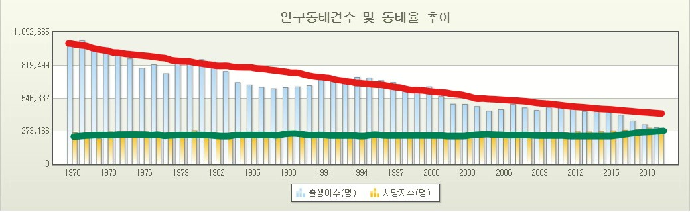

# Population-Decrease-Of-ROK
Finding out when population of ROK(Republic Of Korea) will be 0 if low birth rate of ROK persists. Calculated by Gradient Descent and limit of a sequence.

## 대한민국의 인구는 언제 0명이 될까?

**확률적경사하강법(Stochastic Gradient Descent)과 수열의 극한 사용**

현재 대한민국은 저출산 고령화 문제를 겪고 있다.

노령 인구의 증가로 인해 사망률은 점차 높아지는 데 비해 출산율이 급격히 낮아지고 있기 때문이다.

그런데 문득, 이대로 가다간 언젠가 한국의 인구가 0명이 되지는 않을까? 하는 생각이 들었다.

그래서 직접 한 번 구해보기로 했다.

먼저, [통계청](http://kostat.go.kr/portal/korea/index.action)에서 출생아와 사망자의 인구동태를 찾아보았다.

도표를 보자마자 난관에 봉착했다.

출생아수가 거의 요동치다시피하며 감소하고 있다.

이러면 등차 혹은 등비수열이 아니기 때문에 수열의 극한을 사용할 수가 없다.

그렇다면 아래 그림과 같이 출생아수와 사망자수를 대표하는 직선을 찾아야하는데,

1970년의 값과 2018년의 값을 가지고 냅다 직선을 그어버리는 것은 각각의 값들을 대표한다고 보기 어렵다.

이 때 인공지능을 공부하며 익힌 경사하강법Gradient Descent이 떠올라, 이를 통해 각 데이터를 대표하는 직선을

구해보기로 했다.

먼저, 출생아수를 대표하는 가설함수Hypothesis H(x)가 있다고 하자.

x값은 년도, H(x)값은 출생아수 이다.

이 함수는 일차함수이기 때문에 H(x) = Wx+b 와 같이 나타낼 수 있다.

(보통 인공지능 신경망에서 W는 가중치Weight를, b는 편향bias을 나타내지만, 지금은 직선의 기울기와 y절편이다.)

이 때, 임의의 W와 b 값에 대한 평균제곱오차MSE, Mean Squared Error(혹은 비용함수cost function)를 구한다.

$$
MSE = \frac{1}{n}\sum ^{n}_{i=1}({y_i - \hat{y_i}})^2\\\;\\
※ n은\; 년도의\; 개수이고,\; y_i는\; i번째\; 년도의\; 출생아수,\; \hat{y_i}는\; 가설함수의\; i번째\; 년도의\; 출생아수이다.
$$

MSE를 정리해보면 다음과 같은 식이 나온다.
$$
\begin{align}
MSE&=\frac{1}{n}\sum ^n _{i=1}({y_i}-\hat{y_i})^2\\
&=\frac{1}{n}\{(y_1-wx_1-b)^2+\dots+(y_n-wx_n-b)^2\}\\
&=\frac{1}{n}\{(x_1^2+\dots+x_n^2)w^2+★\}\qquad(for\;w)\\
&=\frac{1}{n}\{nb^2+◆\}\qquad(for\;b)\\\;\\
&※편의상\; 불필요한\; 값들은\; ★과\; ◆로\; 대체함.
\end{align}
$$

위에서 도출한 식에 따르면 W와 b에 따른 비용함수MSE는 위 그림처럼 이차함수로 나타낼 수 있다.

여기서, MSE는 오차들의 합이기 때문에 MSE가 최소가 되는 W와 b의 값이 최적의 직선을 나타낼 것이다.

 그렇다면 이 값들은 어떻게 찾을까?

임의의 W값이 아래 그림과 같이 주어졌다고 하자.

최적의 W값을 구하려면

초기 W값에서, 비용함수MSE의 변수 W에 대한 편미분에 학습률(η)이라 불리는 양의 실수를 곱한 값을 빼나간다.

$$
W := W-η\frac{∂}{∂W}MSE
$$

이러면 비용함수가 감소하는 구간에서는 편미분 값이 음수, η값이 양수이므로 조금씩 오른쪽으로 이동하고,

비용함수가 증가하는 구간에서는 편미분 값이 양수, η값이 양수이므로 조금씩 왼쪽으로 이동한다.

(여기서 학습률(η)이 너무 작으면 최적의 W값을 구하는데 시간이 너무 오래 걸리고,

학습률(η)이 너무 크면 최적의 W값을 건너뛰고 발산해버릴 수도 있으므로, 적당히 0.001정도로 설정한다)

(이 방식이 경사하강법인 이유가 여기서 나오는데, 편미분 값(접선의 경사)을 점점 하강시키기 때문에 이러한 이름이 붙었다)

점점 하강시켜 기울기가 0이되면 최적의 W값을 찾을 수 있다.

같은 방식으로 최적의 b값도 찾으면, 출생아수를 대표하는 가설함수 H(x)를 구할 수 있게 된다.

사망자수를 대표하는 가설함수 역시 같은 방식으로 구한다.

그럼, 코드를 한 번 짜보도록 하자.

$$
\begin{align}
&출생아수\; 함수는\; H(x) = -19331x + 39200083\; 이고,\\
&사망자수\; 함수는\; H(x) = 2378x - 4492000\; 이었다.
\end{align}
$$

사람 수는 정수 범위에서 표현되어야 하므로 소수점 아래 첫째자리에서 반올림하였다.

출생아수와 사망자수의 수열을 구했으나 변수가 하나 있다.

사망자수는 얼마든지 증가할 수 있으나, 출생아수는 음수로 갈 수 없다.

따라서 출생아수가 0이 되는 해를 먼저 구한다.

계산에 따르면 x=2027.8352... 즉, 2028년부터 우리나라에는 아기가 태어나지 않는다.

생각보다 많이 가까워서 놀랐다.

2027년까지의 인구수변화량은 -21709x + 43692083의 함수를 따른다.

실제 인구에서 매년의 인구수변화량을 더해야 하므로 인구수변화량 함수를 적분한다.

$$
\begin{align}
\int ^2027 _2019 (-21709x + 43692083) &= [-10854.5x^2 + 43692083x] ^2027 _2019 \\
&= (-44598198930.5 + 88563852241) - (-44246860474.5 + 88214315577)
&= -1801972
\end{align}
$$

2019년의 인구가 51629512명이므로 2027년에는 49827540명이다.

이후 출생아 없이 사망자만 있으므로 2378x - 4492000을 적분한 값이 49827540을 초과하는 첫 년도를 구해보자.

$$
\begin{align}
\int ^a _2028 (2378x - 4492000) &= [1189x^2 - 4492000x] ^a _2028 \\
&= (1189a^2 - 4492000a) - (4890100176 - 9109776000) <= 49827540 \\
1189a^2 - 4492000a + 4169848284 <= 0 \\
1641.5298 <= a <= 2136.4348...
\end{align}
$$

년도는 정수형태로 나와야하기 때문에 2137년에 한국은 인구 수가 0명이 된다.

물론 위 계산은 모두 일반화 -> 추정의 단계를 거쳐 계산한 결과이므로 정확하다고는 할 수 없다.

1960년대에 있었던 베이비붐 세대가 100세까지 산다고 가정할 때,

2060년까지 사망자수가 급격히 늘고, 이후 급격히 줄어들텐데 이와 같은 과정은 고려하지 않았기 때문이다.

이외에도 다양한 사회/정치적 환경의 변화 등의 변수는 고려하지 않았다.

따라서 위의 계산 과정을 심각하게 받아들이지는 말자.

그러나 10만km^2이나 되는 땅에 아무도 살지 않는 미래, 2137년을 예방하기 위해서는 대책이 필요할 것이다.
